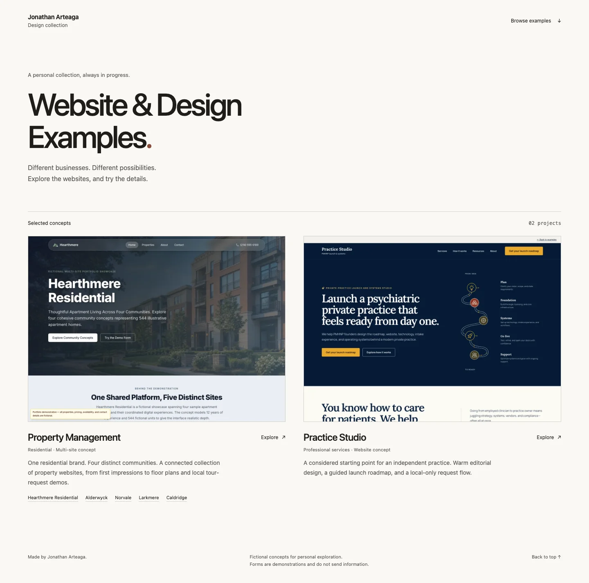

# site-examples

A public collection of fictional website and interface prototypes. **Stage:** active static gallery with two concepts and six site experiences; the new Vercel project is being verified for this clean source. Each concept keeps its own visual identity and framework while one build publishes the gallery and demos.



## What is here

- `apps/gallery/`: the index and screenshots.
- `apps/hearthmere-residential/`: a fictional property-management site and four connected community sites.
- `apps/practice-studio/`: an editorial practice-launch prototype with a local roadmap-request dialog.
- `packages/`: shared code used where the apps actually need it.
- `examples.json` and `scripts/`: catalog, static assembly, media and privacy checks, and production smoke tests.

The gallery is indexable; the demos are marked noindex. Names, properties, operating details, and sample interactions are fictional. Forms demonstrate a flow and do not send or retain information.

## Run and check

Use Node.js 22 or newer and pnpm 11.9.0 from the repository root:

```sh
pnpm install --frozen-lockfile
pnpm build
pnpm preview
```

Open <http://127.0.0.1:3000>. `pnpm build` assembles `.vercel/output` using the same static routes and headers intended for Vercel. To run the full repository gate, install Chromium and verify:

```sh
pnpm exec playwright install chromium
pnpm verify
```

`verify` runs lint, type checks, the static build, image and privacy audits, contracts, Practice Studio packaging, and browser tests. `pnpm dev` serves the gallery at port 3001; `pnpm dev:hearthmere-residential` and `pnpm dev:practice-studio` run the apps separately. See [deployment](docs/deployment.md) for the build contract and [adding an example](docs/adding-examples.md) for new workspaces.

## Ownership and license

The source is public for inspection. The original code is MIT licensed under [LICENSE](LICENSE), and Practice Studio retains its [own MIT license](apps/practice-studio/LICENSE). Third-party assets and dependencies keep their respective terms. The examples are portfolio demonstrations, not live businesses or services.
