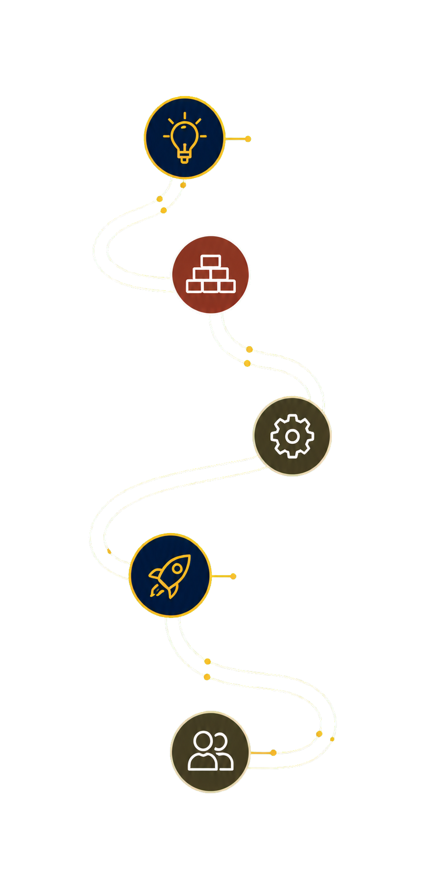

# Practice Studio

A fictional, responsive practice-launch website prototype within [site-examples](../../README.md). **Stage:** active static demo. Its editorial homepage, mobile navigation, and roadmap-request dialog work locally; the form does not transmit or persist information.



## Run and check

Use Node.js 22 or newer and pnpm 11.9.0 from the repository root:

```sh
pnpm install --frozen-lockfile
pnpm --filter practice-studio dev
pnpm --filter practice-studio build
pnpm --filter practice-studio test:sites
```

The root `pnpm build` also assembles this site under `/examples/practice-studio/` in the gallery. The standalone build retains a Sites-ready worker for a separate handoff. The root `pnpm verify` checks the combined static output and browser behavior.

[Open the published demo](https://site-examples-ebon.vercel.app/examples/practice-studio/).

## Scope

The dialog traps focus, closes with Escape, restores focus, and validates basic business contact fields. It explicitly excludes patient information. The site is a demonstration of a possible launch path, not a live practice or submission service.

The original code is MIT licensed; see [LICENSE](LICENSE). Third-party assets keep their own terms.
